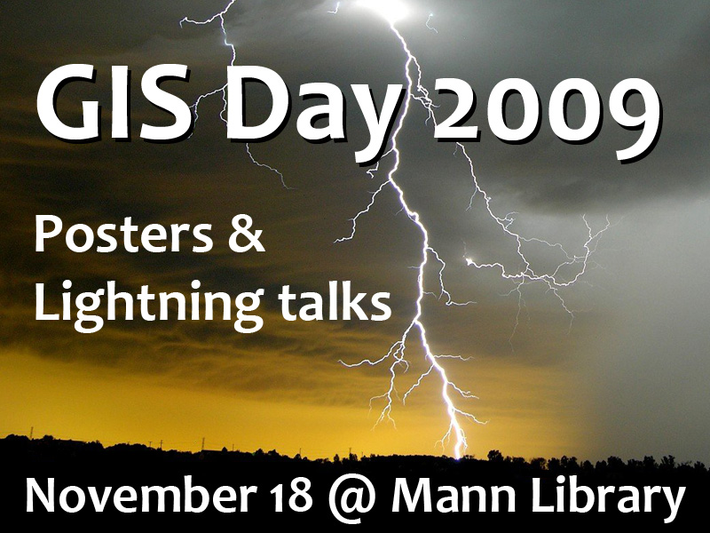

# GIS Day 2009

Wednesday, November 18, 2009 \
Mann Library 102

GIS Day is held each November during Geography Awareness Week, with events in more than 80 countries. Local events in Ithaca were organized by members of [SynerGIS](https://synergis-ny.github.io/), a group of GIS professionals, managers, and students from Cornell, Tompkins County, and the surrounding area.

## Schedule of events

- 12:00 - 1:30pm : Lightning Talks
- 1:30 - 2:30pm : Open House and Poster Session

### Lightning Talks (12:00pm to 1:30pm)

GIS Day 2009 featured a series of short, 5-minute presentations given by folks from across several Cornell departments and local governments, each sharing a bit of what they are doing with Geographic Information Systems (GIS). Presentation slides and websites are linked below:

- Stephen DeGloria. [Current Teaching and Research Projects](slides/DeGloria.pdf)
- James Mastroianni. [Red Canyon Creek WY hydro-geo morphology](slides/Mastroianni.pdf)
- Patrick McNally. [Use of GIS in Species Distribution Modeling](slides/McNally.pdf)
- Amy Bleisch. [Wildlife Spatial Ecology: Deer Home Range Size and Resource Selection on the Cornell Campus](slides/Bleisch.pdf)
- Chris Yenkey. [Spatial analysis in a diffusion study: Using GIS to understand the spread of investor capitalism in Kenya](slides/Yenkey.pdf)
- Nij Tontisirin. [Spatial Analysis of Iroquois Settlements, 1600-1700](slides/Tontisirin.pdf)
- Bob Kibbee. [Sanborn Fire Insurance Maps of Tompkins County: Online Access, Geography, and the Texture of Historical Data](slides/Kibbee.pdf)
- Ruth Aslanis. [Census 2010: Local Update of Census Addresses](slides/Aslanis.pdf)
- Jan Vink. [2010 Census: Count Review program](slides/Vink.pdf)
- Mary Schwarz. New York State Compost Facilities Map
    - [NYS Compost Facilities Map](http://compost.css.cornell.edu/maps.html)
    - [US Butcher Waste and Mortality Disposal Laws](http://compost.css.cornell.edu/mapsdisposal.html)
- Noni Korf Vidal. All Over the Map: from Hydrology to Hip Hop
    - [Cayuga Lake Watershed](http://mapping.cit.cornell.edu/cayuga/map/index.cfm)
    - [Farmer-center Research and Extension](http://mapping.cit.cornell.edu/fcre/map/index.cfm)
    - [Education 2710: American Education](http://mapping.cit.cornell.edu/education2710/map/index.cfm)
    - [Researching Hip-Hop: Born in the Bronx](http://mapping.cit.cornell.edu/hiphop/map/index.cfm)
- Susan Hoskins. [4-H Geospatial Education](slides/Hoskins.pdf)
- Stephen Polzella. [GIS in the Town of Big Flats](slides/Polzella.pdf)
- John Licitra. [Town of Ithaca: Public Works](slides/Licitra.pdf)
- Svetla Borovska. [Tompkins County Mapping](slides/Borovska.pdf)
- Fred Cowett. [The Cornell Campus Tree Inventory](slides/Cowett.pdf)
- Chris Marx. Citizen Science
    - [Project FeederWatch](https://web.archive.org/web/20091217075639/http://watch.birds.cornell.edu/PFW/ExploreData?cmd=mapRoom)
    - [The YardMap Network](https://web.archive.org/web/20100903161839/http://www.birds.cornell.edu/citscitoolkit/projects/clo/yardmap/)
- Karen Edelstein. Careers in GIS

### Open House and Poster Session (1:30 to 2:30pm)

After the lightning talks, an open house provided an opportunity for presenters and audience members to mix and mingle, seeking out that person who gave that great lightning talk earlier, to ask questions and learn more.